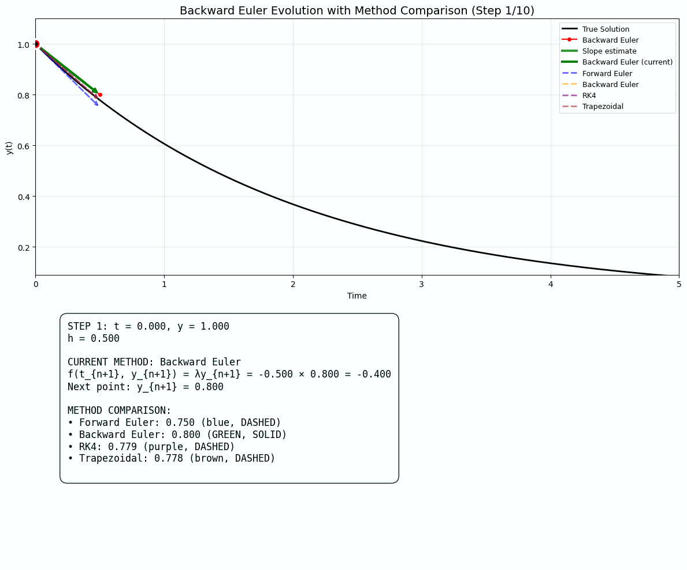

# Numerical Solutions to ODEs and PDEs

A comprehensive implementation of finite difference methods for solving ordinary differential equations (ODEs), with interactive visualizations and stability analysis.

## Overview

This project implements and compares four fundamental numerical methods for solving the simple ODE:

**dy/dt = λy** with initial condition **y(0) = y₀**

The analytical solution is **y(t) = y₀ e^(λt)**.

## Implemented Methods

### 1. Forward Euler (Explicit)
- **Scheme**: y_{k+1} = y_k + h·λ·y_k
- **Stability**: Conditionally stable (|1 + λh| ≤ 1)
- **Order**: O(h)

### 2. Backward Euler (Implicit)  
- **Scheme**: y_{k+1} = y_k + h·λ·y_{k+1}
- **Stability**: Unconditionally stable for λ < 0
- **Order**: O(h)

### 3. Trapezoidal Method (Implicit)
- **Scheme**: y_{k+1} = y_k + (h/2)·[λy_k + λy_{k+1}]
- **Stability**: A-stable
- **Order**: O(h²)

### 4. Runge-Kutta 4th Order (RK4)
- **Scheme**: 4-stage explicit method
- **Stability**: Larger stability region than Forward Euler
- **Order**: O(h⁴)

## Features

### 📊 Interactive Visualizations
- **Interactive plots** with sliders to adjust λ and h parameters in real-time
- **Stability region plots** showing mathematical boundaries in the complex plane
- **Error analysis** comparing global and truncation errors
- **Convergence analysis** demonstrating order of accuracy

### 🎬 Animated Solutions
The following GIFs show the step-by-step evolution of each numerical method:

#### Forward Euler Method


#### Backward Euler Method  


#### Trapezoidal Method


#### Runge-Kutta 4th Order (RK4)


### 📈 Stability Analysis


The stability regions plot shows:
- **Red**: Forward Euler stability region (circle centered at -1)
- **Blue**: Backward Euler stability region (exterior of unit circle centered at 1)
- **Green**: Trapezoidal method stability region (left half-plane)
- **Purple**: RK4 stability region (larger than Forward Euler)

## Usage

### Prerequisites
```bash
pip install numpy matplotlib pillow
```

### Running the Code
```bash
python numerical_ode.py
```

This will generate:
1. **Stability regions plot** (`stability_regions.png`)
2. **Solutions and errors comparison** plots
3. **Interactive plot** with sliders for λ and h
4. **Animated GIFs** showing method evolution

### Key Functions

- `forward_euler()`, `backward_euler()`, `trapezoidal_method()`, `rk4_method()`: Core numerical methods
- `plot_stability_regions()`: Generates stability analysis plots
- `plot_interactive_solutions()`: Creates interactive visualizations with sliders
- `create_method_animation_gif()`: Generates step-by-step animations
- `plot_solutions_and_errors()`: Comprehensive error analysis

## Mathematical Background

### Stability Analysis
For the test equation dy/dt = λy, stability requires that numerical solutions remain bounded as t → ∞ when λ < 0.

- **Forward Euler**: Stable when |1 + λh| ≤ 1
- **Backward Euler**: Stable when |1/(1 - λh)| ≤ 1  
- **Trapezoidal**: Stable when |(1 + λh/2)/(1 - λh/2)| ≤ 1
- **RK4**: More complex stability polynomial

### Error Analysis
- **Global Error**: Difference between numerical and analytical solutions
- **Truncation Error**: Local discretization error at each step
- **Convergence Order**: Rate at which error decreases as h → 0

## Applications

This framework provides a foundation for:
- **Stiff ODE systems** (comparing implicit vs explicit methods)
- **Parameter studies** (understanding stability constraints)
- **Method selection** (choosing appropriate schemes for different problems)
- **Educational visualization** (understanding numerical method behavior)

---

# Numerical Solutions to PDEs

A comprehensive implementation of finite difference methods for solving partial differential equations (PDEs), featuring the **1D Heat Equation** and **2D Poisson Equation** with advanced visualizations.

## PDE Problems Solved

### 1. 1D Heat Equation (Parabolic PDE)
**∂u/∂t = α ∂²u/∂x²** on domain [0,L] × [0,T]

- **Physical meaning**: Heat diffusion in a 1D rod
- **Method**: Explicit finite differences (Forward Euler in time)
- **Stability**: Conditionally stable (r = α·Δt/Δx² ≤ 0.5)
- **Boundary conditions**: Dirichlet (fixed temperature at ends)

### 2. 2D Poisson Equation (Elliptic PDE)
**∇²u = ∂²u/∂x² + ∂²u/∂y² = f(x,y)** on domain [0,Lx] × [0,Ly]

- **Physical meaning**: Steady-state heat distribution, electrostatic potential
- **Methods**: Jacobi and Gauss-Seidel iterative solvers
- **Convergence**: Jacobi slower but parallelizable, Gauss-Seidel faster convergence
- **Boundary conditions**: Dirichlet (u = 0 on all boundaries)

## PDE Numerical Techniques

### Heat Equation: Explicit Finite Differences
```
u[i,n+1] = u[i,n] + r*(u[i+1,n] - 2*u[i,n] + u[i-1,n])
```
- **Time marching**: Forward Euler
- **Space discretization**: Central differences
- **Stability constraint**: r ≤ 0.5

### Poisson Equation: 5-Point Stencil
```
u[i,j] = (u[i+1,j] + u[i-1,j] + u[i,j+1] + u[i,j-1] - h²f[i,j]) / 4
```
- **Jacobi**: Use old values for all neighbors
- **Gauss-Seidel**: Use updated values immediately
- **Convergence**: Iterate until |u_new - u_old| < tolerance

## 🎬 PDE Animations

### Heat Equation Evolution


Shows temperature diffusion over time with Gaussian initial condition.

### Heat Equation Lattice Construction


Visualizes the space-time grid construction showing computed (blue) vs uncomputed (grey) points.

### Poisson Equation: Jacobi Iteration


Demonstrates Jacobi method convergence with consistent colorbar scaling.

### Poisson Equation: Gauss-Seidel Iteration  


Shows faster convergence of Gauss-Seidel compared to Jacobi method.

### Enhanced 2D Poisson Stencil Animation


**Ultra-detailed visualization** showing:
- **20 complete sweeps** of Gauss-Seidel iteration
- **Visited points turn blue** as algorithm progresses  
- **Left-to-right stencil movement** (proper traversal order)
- **Mountain/hill solution shape** appearing as convergence progresses
- **Real-time solution evolution** with color-coded background
- **5-point stencil pattern** with lime connections to current point
- **Enhanced legend** showing all point types and their meanings
- **Complete convergence** from initial guess to final solution

## 📊 PDE Analysis Plots

### Heat Equation Analysis


Comprehensive analysis showing:
- **Space-time contour plot**: Temperature evolution
- **Temperature profiles**: Solutions at different times
- **Time evolution**: Temperature vs time at specific points
- **Stability analysis**: r-parameter visualization
- **Energy evolution**: L² norm over time
- **Temperature extremes**: Maximum and minimum values

### Poisson Equation Analysis


Detailed comparison featuring:
- **Jacobi solution**: Contour plot with iteration count
- **Gauss-Seidel solution**: Faster convergence visualization
- **Method comparison**: Absolute difference between methods
- **Convergence rates**: Residual evolution comparison
- **Cross-sections**: 1D cuts through 2D solution
- **3D surface plot**: Complete solution visualization

## PDE Usage

### Prerequisites
```bash
pip install numpy matplotlib pillow
```

### Running PDE Solvers
```bash
python numerical_pde.py
```

This generates:
1. **Heat equation evolution GIF** (`heat_evolution.gif`)
2. **Heat lattice construction GIF** (`heat_lattice.gif`)
3. **Poisson Jacobi iteration GIF** (`poisson_jacobi.gif`)
4. **Poisson Gauss-Seidel GIF** (`poisson_gauss_seidel.gif`)
5. **5-point stencil animation** (`stencil_animation.gif`)
6. **Heat equation analysis plot** (`heat_equation_analysis.png`)
7. **Poisson equation analysis plot** (`poisson_equation_analysis.png`)

### Key PDE Functions

- `solve_heat_equation_1d()`: Explicit finite difference solver for heat equation
- `solve_poisson_2d_jacobi()`: Jacobi iterative solver for Poisson equation
- `solve_poisson_2d_gauss_seidel()`: Gauss-Seidel iterative solver
- `create_heat_equation_gif()`: Animates heat diffusion process
- `create_heat_lattice_animation()`: Shows space-time grid construction
- `create_poisson_iteration_gif()`: Visualizes iterative convergence
- `create_grid_update_animation()`: Ultra-detailed stencil movement animation
- `plot_heat_results()`: Comprehensive heat equation analysis
- `plot_poisson_results()`: Detailed Poisson equation comparison

## Mathematical Background: PDEs

### Heat Equation (Parabolic)
- **Physical process**: Diffusion, heat conduction
- **Time-dependent**: Evolution from initial condition
- **Stability**: CFL condition r ≤ 0.5 for explicit schemes
- **Smoothing effect**: Discontinuities are immediately smoothed

### Poisson Equation (Elliptic)
- **Physical process**: Steady-state phenomena, equilibrium
- **Boundary value problem**: Solution determined by boundary conditions
- **Iterative solution**: Requires iterative methods for large systems
- **Convergence**: Jacobi O(h²) per iteration, Gauss-Seidel ~2x faster

### Finite Difference Stencils
- **Heat equation**: 3-point stencil in space, forward in time
- **Poisson equation**: 5-point stencil (North, South, East, West, Center)
- **Accuracy**: Second-order accurate in space
- **Grid refinement**: Smaller h improves accuracy but increases computational cost


