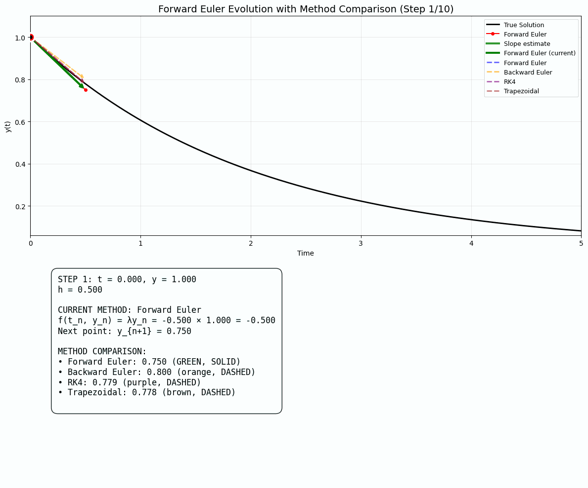

# Numerical Solutions to ODEs and PDEs

A comprehensive implementation of finite difference methods for solving ordinary differential equations (ODEs), with interactive visualizations and stability analysis.

## Overview

This project implements and compares four fundamental numerical methods for solving the simple ODE:

**dy/dt = λy** with initial condition **y(0) = y₀**

The analytical solution is **y(t) = y₀ e^(λt)**.

## Implemented Methods

### 1. Forward Euler (Explicit)
- **Scheme**: y_{k+1} = y_k + h·λ·y_k
- **Stability**: Conditionally stable (|1 + λh| ≤ 1)
- **Order**: O(h)

### 2. Backward Euler (Implicit)  
- **Scheme**: y_{k+1} = y_k + h·λ·y_{k+1}
- **Stability**: Unconditionally stable for λ < 0
- **Order**: O(h)

### 3. Trapezoidal Method (Implicit)
- **Scheme**: y_{k+1} = y_k + (h/2)·[λy_k + λy_{k+1}]
- **Stability**: A-stable
- **Order**: O(h²)

### 4. Runge-Kutta 4th Order (RK4)
- **Scheme**: 4-stage explicit method
- **Stability**: Larger stability region than Forward Euler
- **Order**: O(h⁴)

## Features

### 📊 Interactive Visualizations
- **Interactive plots** with sliders to adjust λ and h parameters in real-time
- **Stability region plots** showing mathematical boundaries in the complex plane
- **Error analysis** comparing global and truncation errors
- **Convergence analysis** demonstrating order of accuracy

### 🎬 Animated Solutions
The following GIFs show the step-by-step evolution of each numerical method:

#### Forward Euler Method


#### Backward Euler Method  


#### Trapezoidal Method


#### Runge-Kutta 4th Order (RK4)


### 📈 Stability Analysis


The stability regions plot shows:
- **Red**: Forward Euler stability region (circle centered at -1)
- **Blue**: Backward Euler stability region (exterior of unit circle centered at 1)
- **Green**: Trapezoidal method stability region (left half-plane)
- **Purple**: RK4 stability region (larger than Forward Euler)

## Usage

### Prerequisites
```bash
pip install numpy matplotlib pillow
```

### Running the Code
```bash
python numerical_ode.py
```

This will generate:
1. **Stability regions plot** (`stability_regions.png`)
2. **Solutions and errors comparison** plots
3. **Interactive plot** with sliders for λ and h
4. **Animated GIFs** showing method evolution

### Key Functions

- `forward_euler()`, `backward_euler()`, `trapezoidal_method()`, `rk4_method()`: Core numerical methods
- `plot_stability_regions()`: Generates stability analysis plots
- `plot_interactive_solutions()`: Creates interactive visualizations with sliders
- `create_method_animation_gif()`: Generates step-by-step animations
- `plot_solutions_and_errors()`: Comprehensive error analysis

## Mathematical Background

### Stability Analysis
For the test equation dy/dt = λy, stability requires that numerical solutions remain bounded as t → ∞ when λ < 0.

- **Forward Euler**: Stable when |1 + λh| ≤ 1
- **Backward Euler**: Stable when |1/(1 - λh)| ≤ 1  
- **Trapezoidal**: Stable when |(1 + λh/2)/(1 - λh/2)| ≤ 1
- **RK4**: More complex stability polynomial

### Error Analysis
- **Global Error**: Difference between numerical and analytical solutions
- **Truncation Error**: Local discretization error at each step
- **Convergence Order**: Rate at which error decreases as h → 0

## Applications

This framework provides a foundation for:
- **Stiff ODE systems** (comparing implicit vs explicit methods)
- **Parameter studies** (understanding stability constraints)
- **Method selection** (choosing appropriate schemes for different problems)
- **Educational visualization** (understanding numerical method behavior)

## Future Extensions

- Implementation of higher-order methods (RK45, multistep methods)
- Extension to systems of ODEs
- PDE solvers using finite difference methods
- Adaptive time-stepping algorithms

---

*This project demonstrates the fundamental principles of numerical analysis applied to differential equations, with emphasis on stability, accuracy, and computational efficiency.*